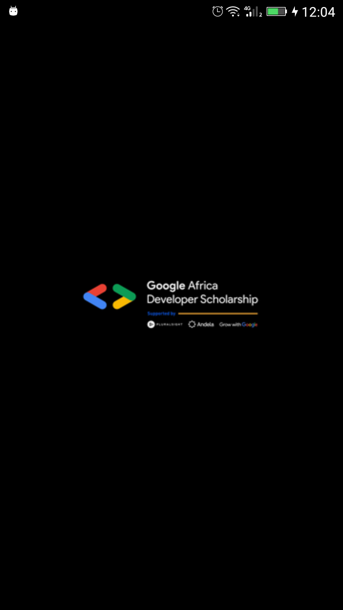
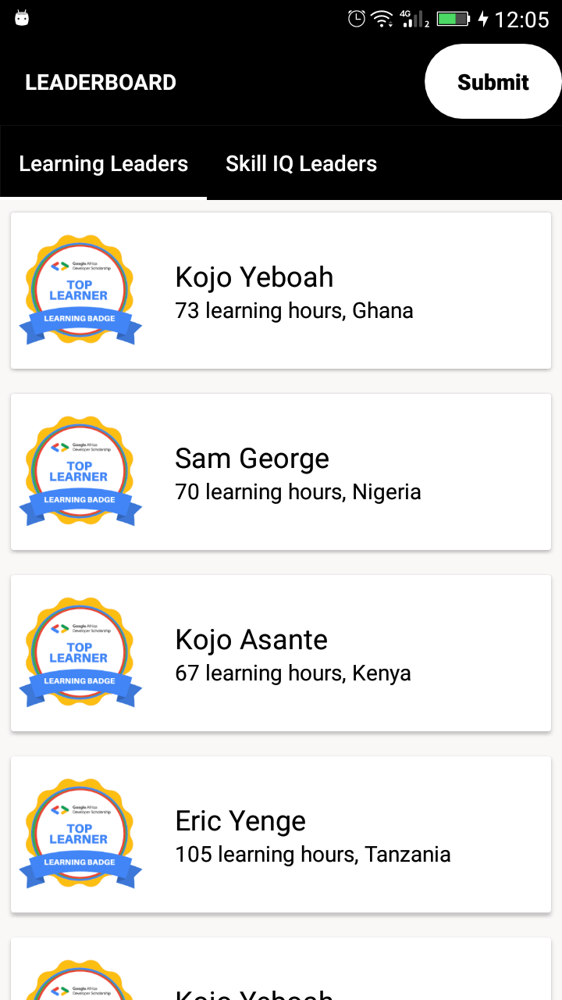
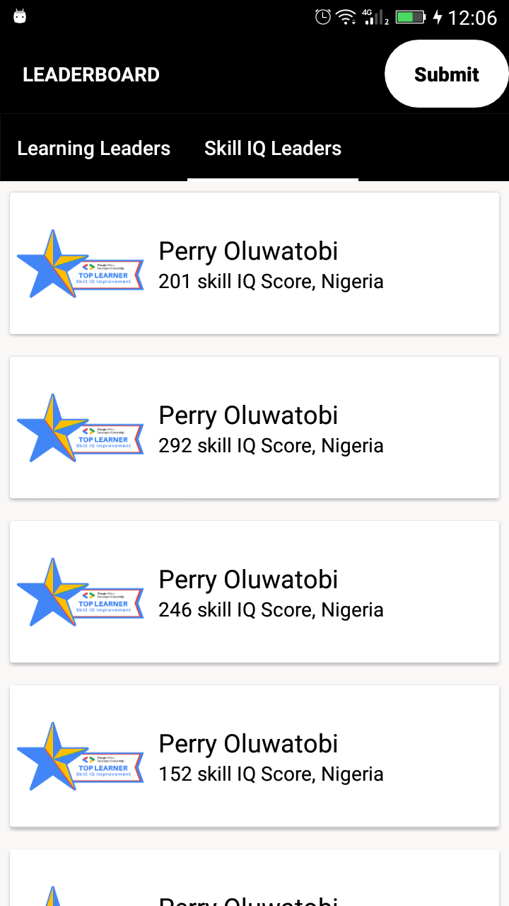
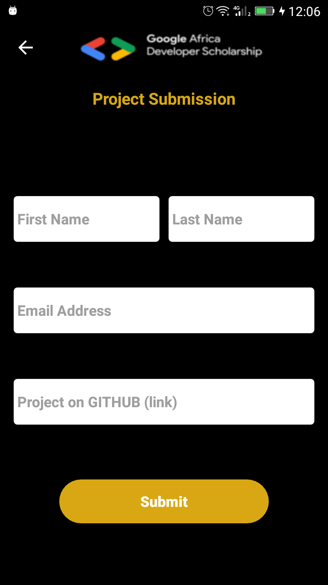
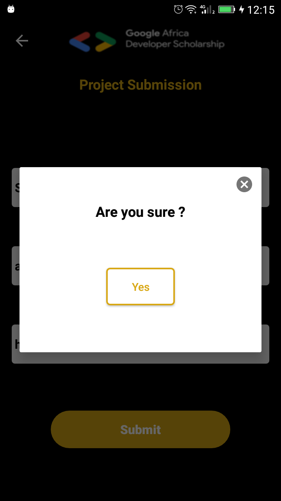
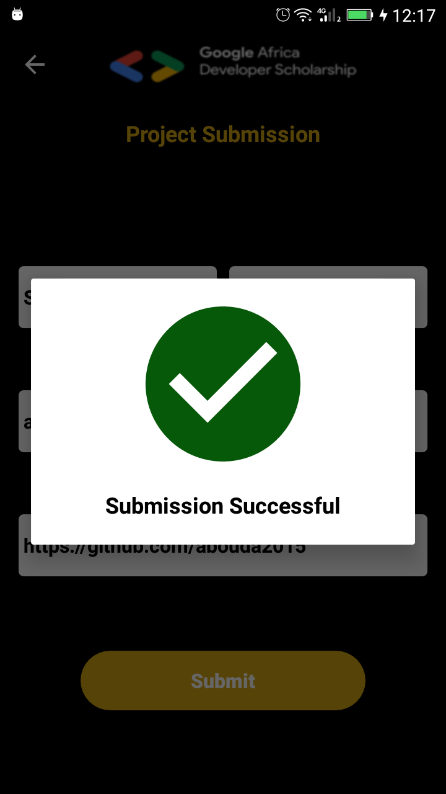
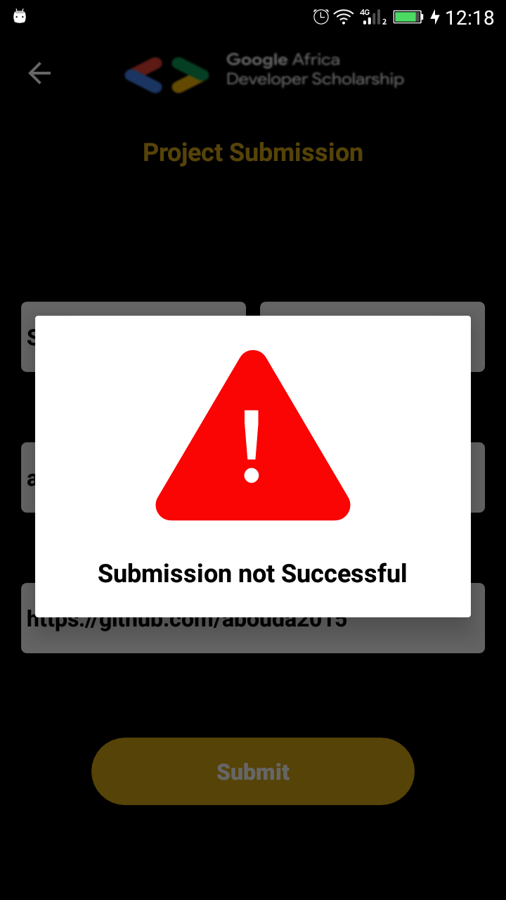

# Google Africa Developer Scholarship
# Practice Project
LeaderBoard

 

# This project will help you understand:
- Multi-Activity Project
- View pager
- Customizing Toolbar
- RecyclerView
- Making Network Request
- Working with Google Form and many more...
# Prerequisites:
min SDK 15
